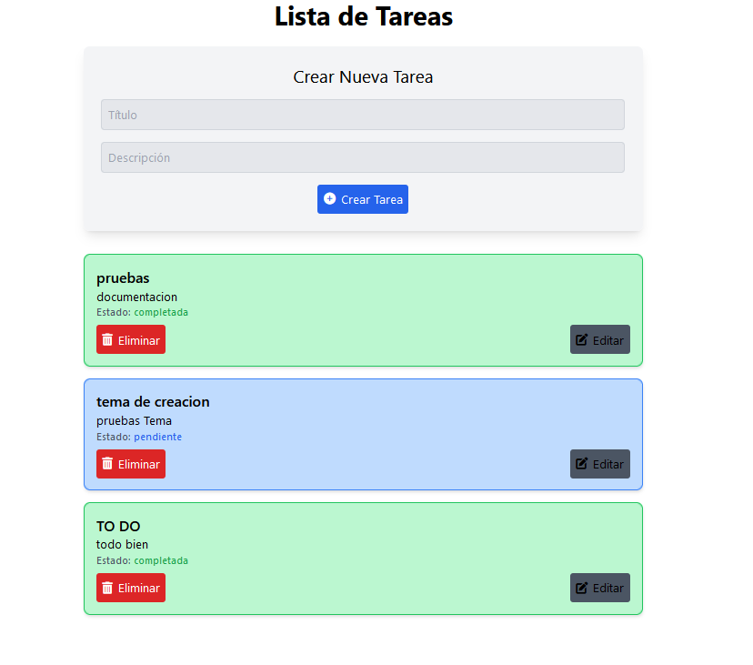
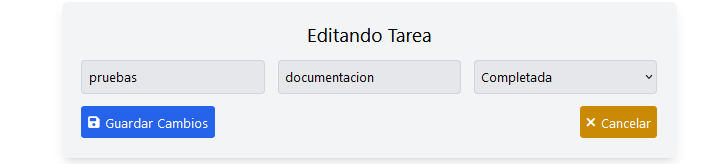

# Título del Proyecto

## Gestión de Tareas

## Descripción del Proyecto
Este proyecto es una aplicación web para gestionar tareas, desarrollada con tecnologías modernas como React, Node.js, Express y MySQL. La aplicación permite a los usuarios crear, editar y eliminar tareas, y también muestra notificaciones personalizadas utilizando Notiflix.

## Formulario de creación


## Formulario de Edición


## Estructura del Proyecto
El proyecto está dividido en dos partes principales:

- **Frontend**: La aplicación web desarrollada con React, que se encarga de interactuar con el usuario y mostrar la interfaz de usuario.
- **Backend**: El servidor API desarrollado con Node.js y Express, que se encarga de gestionar la lógica de negocio y almacenar datos en una base de datos MySQL.

## Tecnologías Utilizadas
### Frontend
- **React**: Biblioteca de JavaScript para desarrollar interfaces de usuario.
- **Notiflix**: Biblioteca de JavaScript para mostrar notificaciones personalizadas.

### Backend
- **Node.js**: Entorno de ejecución de JavaScript para desarrollar servidores.
- **Express**: Framework de Node.js para desarrollar servidores web.
- **MySQL**: Sistema de gestión de bases de datos relacional.

## Instalación y Configuración
Para instalar y configurar el proyecto, sigue los siguientes pasos:

### 1. Instalar Dependencias
- En el directorio **frontend**, ejecuta el comando:
  ```
  npm install

Uso de la Aplicación

Para utilizar la aplicación, sigue los siguientes pasos:
1. Acceder a la Aplicación

Abre un navegador y accede a la URL http://localhost:4000 para acceder a la aplicación.
2. Crear Tareas

Haz clic en el botón "Crear Tarea" para crear una nueva tarea.
3. Editar Tareas

Haz clic en el botón "Editar" para editar una tarea existente.
4. Eliminar Tareas

Haz clic en el botón "Eliminar" para eliminar una tarea existente.
Notificaciones

La aplicación muestra notificaciones personalizadas utilizando Notiflix. Las notificaciones se muestran en la parte superior derecha de la pantalla y permanecen visibles durante un período de tiempo determinado.
Ejecutar Docker

Para ejecutar el contenedor de Docker, sigue los siguientes pasos:
1. Iniciar el contenedor

Abre una terminal y ejecuta el comando:


docker start tasks-backend

2. Verificar el estado del contenedor

Ejecuta el comando:


docker ps

para verificar el estado del contenedor. Debe aparecer en la lista de contenedores en ejecución.
3. Acceder a la aplicación

Abre un navegador y accede a la URL http://localhost:4000 para acceder a la aplicación.
4. Detener el contenedor

Ejecuta el comando:


docker stop tasks-backend

para detener el contenedor.
5. Eliminar el contenedor

Ejecuta el comando:


docker rm tasks-backend

Comandos de Docker

    `docker build -t tasks-backend .`: Crea la imagen Docker a partir del archivo Dockerfile.
    `docker run -p 4000:4000 tasks-backend`: Crea y ejecuta el contenedor a partir de la imagen Docker.
    `docker start tasks-backend`: Inicia el contenedor.
    `docker stop tasks-backend`: Detiene el contenedor.
    `docker rm tasks-backend`: Elimina el contenedor.
    `docker ps`: Verifica el estado de los contenedores en ejecución.
